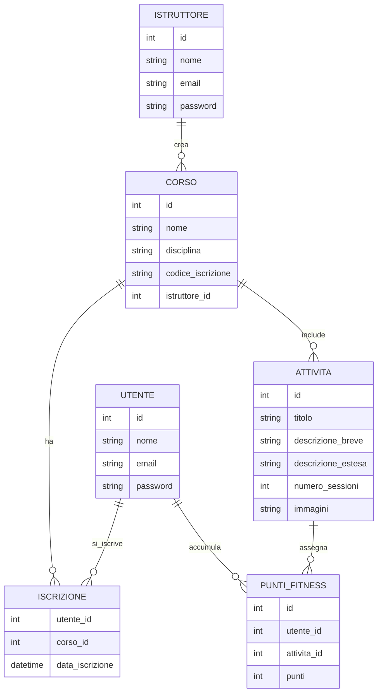

#Palestra

```mermaid
erDiagram
    ISTRUTTORE {
        int id
        string nome
        string email
        string password
    }
    CORSO {
        int id
        string nome
        string disciplina
        string codice_iscrizione
        int istruttore_id
    }
    ATTIVITA {
        int id
        string titolo
        string descrizione_breve
        string descrizione_estesa
        int numero_sessioni
        string immagini
    }
    UTENTE {
        int id
        string nome
        string email
        string password
    }
    ISCRIZIONE {
        int utente_id
        int corso_id
        datetime data_iscrizione
    }
    PUNTI_FITNESS {
        int id
        int utente_id
        int attivita_id
        int punti
    }

    ISTRUTTORE ||--o{ CORSO : crea
    CORSO ||--o{ ISCRIZIONE : ha
    UTENTE ||--o{ ISCRIZIONE : si_iscrive
    CORSO ||--o{ ATTIVITA : include
    UTENTE ||--o{ PUNTI_FITNESS : accumula
    ATTIVITA ||--o{ PUNTI_FITNESS : assegna
```